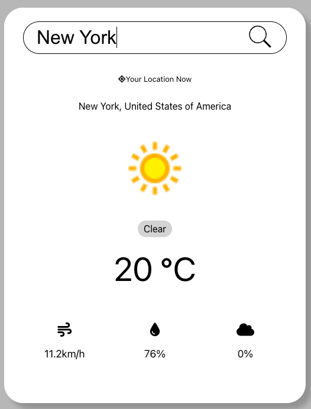

# Weather App

This project was created to practice GraphQL



This project was bootstrapped with [Create React App](https://github.com/facebook/create-react-app).

### For this project I have used these technologies:
- [React](https://reactjs.org/)
- [TypeScript](https://www.typescriptlang.org/)
- [Sass](https://sass-lang.com/)
- [GraphQL](https://graphql.org/)

## How to start

#### Intall [Node.js](https://nodejs.org/en/)

#### Download project

#### In root directory run
```
npm install
```
#### Run project
```
npm start
```

## How to use
Inside search input type some city and you will get results.

## Available Scripts

In the project directory, you can run:

### `npm start`

Runs the app in the development mode.\
Open [http://localhost:3000](http://localhost:3000) to view it in the browser.